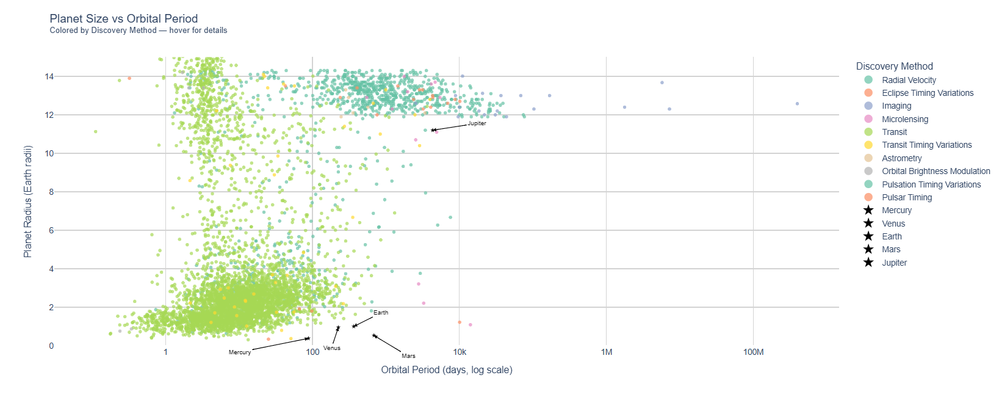
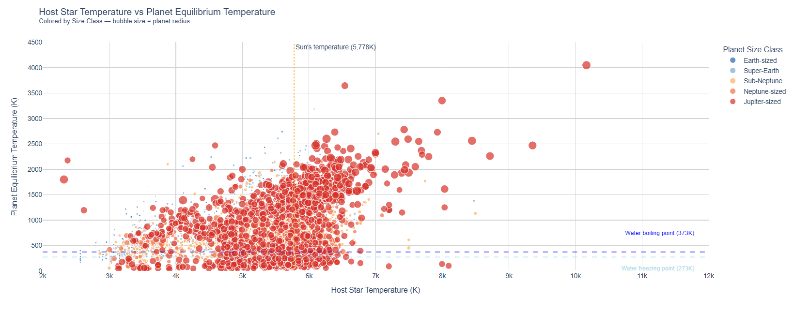
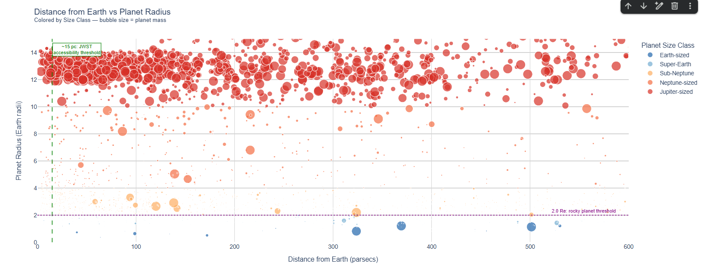
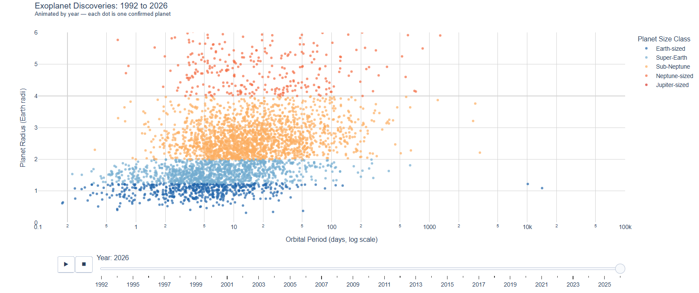

# Exoplanet Interactive Dashboard
### Interactive Plotly Visualizations of 6,298 Confirmed Exoplanets

**Author:** Emma Follis  
**Data source:** [NASA Exoplanet Archive](https://exoplanetarchive.ipac.caltech.edu)  
**Tools:** Python, pandas, Plotly  
**Last updated:** June 2026

[](https://colab.research.google.com/drive/1SeUv66FFpyNAqzCoejis0Pux-aEHqLOy?usp=sharing)

---

## Overview

This project builds an interactive dashboard exploring the NASA Exoplanet Archive's 
confirmed planets table. Unlike static charts, every visualization is fully interactive 
- hover over any planet for details, zoom into regions of interest, toggle size classes 
on and off, and watch the entire history of exoplanet discovery animate year by year.

The dashboard covers four interactive views:

1. Planet size vs orbital period: colored by discovery method with solar system reference points
2. Host star temperature vs planet equilibrium temperature: with habitability reference lines
3. Distance from Earth vs planet radius: with JWST accessibility and rocky planet thresholds
4. Animated discovery timeline: watch the catalog grow from 2 planets in 1992 to 5,911 in 2026

---

## Interactive Charts

> **To use the interactive versions:** download the HTML files and open in any browser,
> or open the notebook in Colab using the badge above.

### Chart 1: Planet Size vs Orbital Period

*Colored by discovery method. Solar system planets marked as stars for reference.
Toggle discovery methods on/off by clicking the legend.*

**[Open interactive version](chart1_size_vs_period.html)**

---

### Chart 2: Host Star Temperature vs Planet Equilibrium Temperature

*Bubble size = planet radius. Reference lines mark water's freezing and boiling points
and the Sun's surface temperature. Planets between the blue lines could support liquid water.*

**[Open interactive version](chart2_star_vs_planet_temp.html)**

---

### Chart 3: Distance from Earth vs Planet Radius

*Bubble size = planet mass. Green dashed line marks the ~15 parsec JWST accessibility 
threshold. Purple dotted line marks the 2.0 Earth radii rocky planet boundary.
Earth-sized planets below the purple line and left of the green line are current 
JWST atmospheric characterization targets.*

**[Open interactive version](chart3_distance_vs_radius.html)**

---

### Chart 4: Animated Discovery Timeline (1992–2026)

*Press play to watch the exoplanet catalog grow year by year. The explosion of 
discoveries in 2014 and 2016 marks NASA Kepler's bulk confirmation events.
Each dot is one confirmed planet.*

**[Open interactive version](chart4_animated_timeline.html)**

---

## Key Findings

**Detection bias is real:** Jupiter-sized planets dominate the confirmed catalog 
despite likely being rarer than smaller planets. Large planets are simply easier 
to detect with current methods.

**The Kepler revolution:** Before 2009 the catalog grew by tens of planets per year. 
After Kepler's launch and especially after the 2014 and 2016 bulk confirmations, 
hundreds were added at once transforming our picture of planetary systems overnight.

**Rocky planets are rare in the catalog but not in reality:** Only 573 confirmed 
Earth-sized planets appear in this dataset. Detection bias strongly favors larger 
planets. Earth-sized worlds are thought to be far more common than this sample suggests.

**JWST targets are close and small:** The most scientifically valuable planets 
(rocky, nearby, and potentially habitable) cluster in the bottom left of Chart 3. 
There are very few of them, which is exactly why atmospheric characterization is 
one of the most active research frontiers in astronomy today.

---

## Repository Structure
```
Exoplanet_Interactive_Dashboard/

├── Exoplanet_Interactive_Dashboard.ipynb  # Full notebook

├── chart1_size_vs_period.html             # Interactive Chart 1

├── chart2_star_vs_planet_temp.html        # Interactive Chart 2

├── chart3_distance_vs_radius.html         # Interactive Chart 3

├── chart4_animated_timeline.html          # Interactive Chart 4

├── chart1_screenshot.png                  # Chart 1 preview

├── chart2_screenshot.png                  # Chart 2 preview

├── chart3_screenshot.png                  # Chart 3 preview

├── chart4_screenshot.png                  # Chart 4 preview

└── README.md                              # This file
```
---

## How to Run

**Option 1 — Google Colab (recommended):**  
Click the Open in Colab badge above. Download the confirmed planets table from the
[NASA Exoplanet Archive](https://exoplanetarchive.ipac.caltech.edu/cgi-bin/TblView/nph-tblView?app=ExoTbls&config=PSCompPars)
and upload it when prompted.

**Option 2 — Local:**
```bash
pip install pandas plotly
jupyter notebook Exoplanet_Interactive_Dashboard.ipynb
```

**Option 3 — Interactive charts only:**  
Download any of the HTML files and open directly in a browser — no Python required.

---

## Data Notes

- Dataset: NASA Exoplanet Archive Planetary Systems Composite Parameters table
- Retrieved: June 2026
- 6,298 confirmed planets, 84 measured variables
- 5,911 planets retained after filtering for radius and orbital period measurements
- Planet mass values capped at 1,000 Earth masses for bubble sizing in Chart 3
- Dummy data points added to Chart 4 first frame to ensure correct Plotly color rendering

---

## About

Built as part of a scientific data analysis portfolio by Emma Follis, a data analyst 
with a background in Earth and Planetary Science. Currently completing an M.S. in 
Space Studies at American Public University while contributing to NASA's Exoplanet 
Watch citizen science program.

[LinkedIn](https://www.linkedin.com/in/emma-follis) |
[GitHub](https://github.com/AstroAstra)
